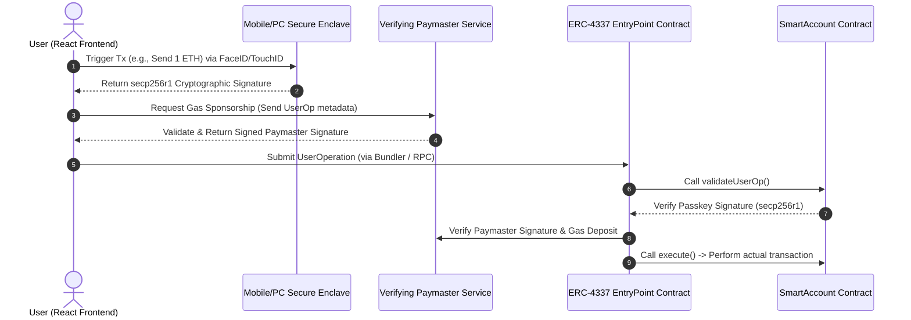

# 🛡️ ZK-Shield: Enterprise-Grade ERC-4337 Smart Contract Wallet

Welcome to **ZK-Shield**, a production-grade, next-generation **ERC-4337 Smart Contract Wallet (Account Abstraction)** built to bridge Web2-level user experience with Web3-grade decentralized security. 

This repository will contain the complete implementation of a hardware-secured, gas-sponsored, privacy-preserving smart contract wallet built from scratch.

> [!IMPORTANT]
> **This project is structured for step-by-step modular development.** We will build this enterprise system chunk-by-chunk, starting from the core Smart Wallet execution logic, and scaling up to cryptographic signature verifiers, gas sponsors, zero-knowledge recovery circuits, and a high-fidelity frontend.

---

## 🗺️ Project Architecture & Components

Instead of relying on third-party SDKs, this project implements the full stack of modern decentralized identity infrastructure. The architecture is split into four distinct layers:

```
d:\BlockChain_1
├── README.md                           # This Master Specification File
├── /contracts                          # Foundry Smart Contract Suite (Solidity)
│   ├── /src
│   │   ├── SmartAccount.sol            # Core Wallet Execution & Validation Logic
│   │   ├── AccountFactory.sol          # CREATE2 Deterministic Deployment Registry
│   │   ├── TokenPaymaster.sol          # Gas Sponsorship & ERC20 gas-conversion Oracle
│   │   ├── ZkSocialRecovery.sol        # ZK-SNARK Merkle Guardian Recovery Verifier
│   │   └── /libraries
│   │       └── WebAuthn.sol            # secp256r1/Passkey signature verification
│   ├── /test                           # Foundry Unit & Integration Tests
│   └── foundry.toml                    # Foundry Configuration
├── /backend                            # Go / TypeScript Relayer & Indexer Suite
│   ├── /paymaster-service              # Verifying Paymaster Gas sponsorship APIs
│   └── /indexer                        # Low-latency gRPC/GraphQL Block Indexer
└── /frontend                           # Sleek React + Vite Glassmorphism Dashboard
```

---

## 🔄 The Lifecycle of a `UserOperation`

To understand how our wallet behaves, here is how a user transaction flows through the system:



---

## 🧱 Detailed Specifications for the Smart Contracts

We will write the smart contracts one-by-one, testing each function exhaustively:

### 1. 🔑 `SmartAccount.sol` (The Wallet Core)
* **Purpose:** Represents the user's on-chain identity. It stores their cryptographic credentials, verifies inbound signatures, and executes instructions.
* **Key Functions:**
  * `validateUserOp(...)`: The standard ERC-4337 validation hook called by the global `EntryPoint` contract.
  * `execute(address dest, uint256 value, bytes calldata func)`: Standard call execution logic.
  * `executeBatch(address[] dests, uint256[] values, bytes[] funcs)`: Groups multiple transactions (e.g., `approve` + `transferFrom` in a single click).
  * `isValidSignature(...)`: Implements EIP-1271 to allow the wallet to log into Web3 apps (like Uniswap or OpenSea) via its Passkey.

### 2. 🏗️ `AccountFactory.sol` (The Wallet Registry)
* **Purpose:** Allows instant, offline wallet generation. A user can receive their wallet address *before* ever spending gas to deploy it.
* **Key Functions:**
  * `createAccount(bytes32 salt, bytes32 passkeyX, bytes32 passkeyY)`: Deploys a new wallet using the **CREATE2 opcode** for deterministic addressing.
  * `getAddress(bytes32 salt, bytes32 passkeyX, bytes32 passkeyY)`: Computes the wallet address mathematically off-chain.

### 3. ⛽ `TokenPaymaster.sol` (The Gas Sponsor)
* **Purpose:** Allows users to pay for network fees using stablecoins (like USDC) instead of ETH, or sponsors gas fees completely based on signature permissions.
* **Key Functions:**
  * `validatePaymasterUserOp(...)`: Checks if a user has sufficient ERC-20 tokens deposited or if the transaction meets off-chain verification limits.
  * `_postOp(...)`: Adjusts and processes token payments after the transaction completes.

### 4. 🛡️ `ZkSocialRecovery.sol` (The Security Net)
* **Purpose:** Recovers wallet ownership using trusted friends (Guardians) without revealing their identities on-chain using zk-SNARKs.
* **Key Logic:**
  * Stores a **Merkle Root** representing the hash of the guardians' secrets.
  * Allows a user to verify a **ZK Proof** generated off-chain in Circom, updating the owner public keys securely and anonymously.

---

## 🚀 The Chunk-by-Chunk Development Plan

We will proceed in deliberate, highly-focused micro-steps:

| Step | Component | Target Milestones | Status |
| :--- | :--- | :--- | :--- |
| **Step 1** | **`SmartAccount.sol` (Part I)** | Write core storage layout, `initialize`, and `execute` functions. | ⌛ *Next Up* |
| **Step 2** | **`SmartAccount.sol` (Part II)** | Integrate ERC-4337 EntryPoint interaction and basic Elliptic Curve verification hooks. | ⌛ Pending |
| **Step 3** | **`WebAuthn.sol` Library** | Write assembly-level secp256r1 curve coordinate validation. | ⌛ Pending |
| **Step 4** | **Foundry Tests (Part I)** | Validate execution, reentrancy guards, and call batching. | ⌛ Pending |
| **Step 5** | **`AccountFactory.sol`** | Code deterministic CREATE2 factory with memory-proxy optimizations. | ⌛ Pending |
| **Step 6** | **`TokenPaymaster.sol`** | Integrate Chainlink Oracle feeds for real-time gas calculations. | ⌛ Pending |
| **Step 7** | **ZK Circuits & Recovery** | Write Circom social recovery logic and generate on-chain Solidity verifier. | ⌛ Pending |

---

## 🛠️ Prerequisites & Local Setup

Before we start coding the first chunk, ensure you have these tools installed locally:
* **Node.js** (v18+) & **NPM/Yarn**
* **Foundry Toolkit** (for compiling, formatting, and executing smart contract tests):
  ```powershell
  # To install Foundry on Windows:
  curl -L https://foundry.paradigm.xyz | bash
  foundryup
  ```

---

> [!TIP]
> **We are ready to write code!** 
> To begin, tell me: **"Write SmartAccount.sol (Part I)"**, and we will write the core storage, standard constructor/initializer, execution interfaces, and basic security modifiers for your smart contract wallet!
